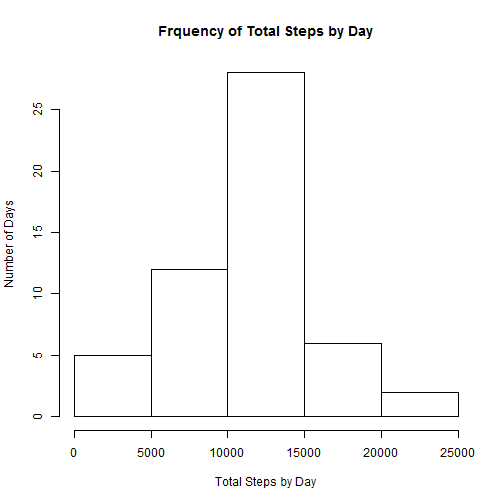
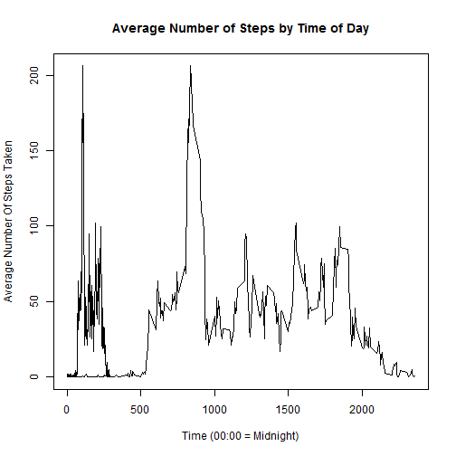
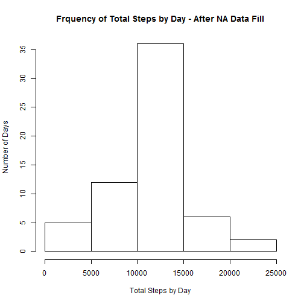
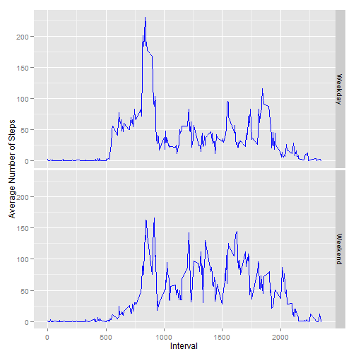

Reproducible Research: Peer Assessment 1
========================================


## Introduction

It is now possible to collect a large amount of data about personal movement using activity monitoring devices such as a Fitbit, Nike Fuelband, or Jawbone Up. These type of devices are part of the “quantified self” movement – a group of enthusiasts who take measurements about themselves regularly to improve their health, to find patterns in their behavior, or because they are tech geeks. But these data remain under-utilized both because the raw data are hard to obtain and there is a lack of statistical methods and software for processing and interpreting the data.  

## Data

This assignment makes use of data from a personal activity monitoring device. This device collects data at 5 minute intervals through out the day. The data consists of two months of data from an anonymous individual collected during the months of October and November, 2012 and include the number of steps taken in 5 minute intervals each day.  

Original URL for Data:  https://d396qusza40orc.cloudfront.net/repdata%2Fdata%2Factivity.zip

The variables included in this dataset are:

* steps: Number of steps taking in a 5-minute interval (missing values are coded as NA)

* date: The date on which the measurement was taken in YYYY-MM-DD format

* interval: Identifier for the 5-minute interval in which measurement was taken

The dataset is stored in a comma-separated-value (CSV) file and there are a total of 17,568 observations in this dataset.


## Loading and Preprocessing the data 


```r
#Load the data
RawActivityData <- read.csv("activity.csv", header=TRUE)
```

The first 5 rows of data:

```r
head(RawActivityData, 5)
```

```
##   steps       date interval
## 1    NA 2012-10-01        0
## 2    NA 2012-10-01        5
## 3    NA 2012-10-01       10
## 4    NA 2012-10-01       15
## 5    NA 2012-10-01       20
```

The last 5 rows of data:

```r
tail(RawActivityData, 5)
```

```
##       steps       date interval
## 17564    NA 2012-11-30     2335
## 17565    NA 2012-11-30     2340
## 17566    NA 2012-11-30     2345
## 17567    NA 2012-11-30     2350
## 17568    NA 2012-11-30     2355
```

Summary Statistics for the dataset:

```r
summary(RawActivityData)
```

```
##      steps               date          interval   
##  Min.   :  0.0   2012-10-01:  288   Min.   :   0  
##  1st Qu.:  0.0   2012-10-02:  288   1st Qu.: 589  
##  Median :  0.0   2012-10-03:  288   Median :1178  
##  Mean   : 37.4   2012-10-04:  288   Mean   :1178  
##  3rd Qu.: 12.0   2012-10-05:  288   3rd Qu.:1766  
##  Max.   :806.0   2012-10-06:  288   Max.   :2355  
##  NA's   :2304    (Other)   :15840
```

## What is the mean total number of steps taken per day?

Question 1: Make a histogram of the total number of steps taken each day?


```r
#Calcualte the average steps per day
TotalStepsByDay <- aggregate(RawActivityData$steps, list(date = RawActivityData$date), sum)

#Display a histogram of the average steps per day
hist(TotalStepsByDay$x,
     main ="Frquency of Total Steps by Day",
     xlab = "Total Steps by Day",
     ylab = "Number of Days")
```

 

Question 2:  Calculate and report the mean and median total number of steps taken per day


```r
#Calcualte the Mean and Median steps per day
MeanSteps <- mean(TotalStepsByDay$x, na.rm = TRUE)
MedianSteps <- median(TotalStepsByDay$x, na.rm = TRUE)
```

Mean of total number of steps taken per day:  10766.2  
Median of total number of steps taken per day:  10765.0


## What is the average daily activity pattern?

Question 1: Make a time series plot of the 5-minute interval (x-axis) and the average number of steps taken, averaged across all days (y-axis)


```r
AverageStepsByTimePeriod <- aggregate(RawActivityData$steps, list(Interval = RawActivityData$interval), mean, na.rm = TRUE)
colnames(AverageStepsByTimePeriod)[2] <- "MeanSteps"
AverageStepsByTimePeriod$IntervalTime <- sprintf("%04d", AverageStepsByTimePeriod$Interval)
AverageStepsByTimePeriod$IntervalTime <- format(strptime(AverageStepsByTimePeriod$IntervalTime, format="%H%M"), format = "%H:%M")
AverageStepsByTimePeriod$IntervalTime <- factor(AverageStepsByTimePeriod$Intervaltime)
```

```
## Error: replacement has 0 rows, data has 288
```

```r
plot(x = AverageStepsByTimePeriod$Interval, y = AverageStepsByTimePeriod$MeanSteps, type = "l", 
     main = "Average Number of Steps by Time of Day",
     xlab = "Time (00:00 = Midnight)",
     ylab = "Average Number Of Steps Taken")
lines(x = AverageStepsByTimePeriod$MeanSteps)
```

 

Question 2:  Which 5-minute interval, on average across all the days in the dataset, contains the maximum number of steps?


```r
TimeOfMaxSteps <- toString(AverageStepsByTimePeriod[which.max(AverageStepsByTimePeriod$MeanSteps), 1])
TimeOfMaxStepsPlusOne <- toString(AverageStepsByTimePeriod[which.max(AverageStepsByTimePeriod$MeanSteps) + 1, 1])
```

The time interval that contains the maximum average number of steps is 835 - 840

## Imputing missing values

Question 1:  Calculate and report the total number of missing values in the dataset (i.e., the total number of rows with NAs).


```r
NaRows <- which(is.na(RawActivityData$steps))
NumberNaRows <- length(NaRows)
```

The number of rows with NA in the dataset:  2304


Question 2:  Devise a strategy for filling in all of the missing values in the dataset. The strategy does not need to be sophisticated. For example, you could use the mean/median for that day, or the mean for that 5-minute interval, etc.

NA values will be filled in with the average number of steps for that 5-minute interval.

Question 3:  Create a new dataset that is equal to the original dataset but with the missing data filled in.


```r
RawActivityData2 <- RawActivityData

for (i in 1:length(NaRows)) {
      IntervalSearch <- RawActivityData[NaRows[i], 3]
      
      AvgRowNumber <- which(AverageStepsByTimePeriod$Interval == IntervalSearch)
      RawActivityData2[NaRows[i], 1] <- AverageStepsByTimePeriod[AvgRowNumber, 2]
}

NaRows2 <- length(which(is.na(RawActivityData2$steps)))
```

The first 5 rows of data:

```r
head(RawActivityData2, 5)
```

```
##     steps       date interval
## 1 1.71698 2012-10-01        0
## 2 0.33962 2012-10-01        5
## 3 0.13208 2012-10-01       10
## 4 0.15094 2012-10-01       15
## 5 0.07547 2012-10-01       20
```

The last 5 rows of data:

```r
tail(RawActivityData2, 5)
```

```
##        steps       date interval
## 17564 4.6981 2012-11-30     2335
## 17565 3.3019 2012-11-30     2340
## 17566 0.6415 2012-11-30     2345
## 17567 0.2264 2012-11-30     2350
## 17568 1.0755 2012-11-30     2355
```

Summary Statistics for the dataset:

```r
summary(RawActivityData2)
```

```
##      steps               date          interval   
##  Min.   :  0.0   2012-10-01:  288   Min.   :   0  
##  1st Qu.:  0.0   2012-10-02:  288   1st Qu.: 589  
##  Median :  0.0   2012-10-03:  288   Median :1178  
##  Mean   : 37.4   2012-10-04:  288   Mean   :1178  
##  3rd Qu.: 27.0   2012-10-05:  288   3rd Qu.:1766  
##  Max.   :806.0   2012-10-06:  288   Max.   :2355  
##                  (Other)   :15840
```

The number of rows with NA in the datset after applying the fill strategy:  0

Question 4:  Make a histogram of the total number of steps taken each day. 


```r
TotalStepsByDay2 <- aggregate(RawActivityData2$steps, list(date = RawActivityData2$date), sum)

hist(TotalStepsByDay2$x,
     main ="Frquency of Total Steps by Day - After NA Data Fill",
     xlab = "Total Steps by Day",
     ylab = "Number of Days")
```

 

Calculate and report the mean and median total number of steps taken per day. 


```r
#Caculate the Mean and the Median
MeanSteps2 <- mean(TotalStepsByDay2$x)
MedianSteps2 <- median(TotalStepsByDay2$x)
```

Mean of total number of steps taken per day:  10766.2  
Median of total number of steps taken per day:  10766.2

Do these values differ from the estimates from the first part of the assignment? What is the impact of imputing missing data on the estimates of the total daily number of steps?

Discussion:  Because the mean of each time period was used as an imputed value, the mean does not change.  There was a slight shift in the meidan.

## Are there differences in activity patterns between weekdays and weekends?


```r
## Add a column for weekday
RawActivityData2$WeekDay <- weekdays(as.POSIXct(as.character(RawActivityData2$date)))
RawActivityData2[RawActivityData2[, 4] == "Saturday", 4] <- "Weekend"
RawActivityData2[RawActivityData2[, 4] == "Sunday", 4] <- "Weekend"
RawActivityData2[RawActivityData2[, 4] != "Weekend", 4] <- "Weekday"
RawActivityData2$WeekDay <- as.factor(RawActivityData2$WeekDay)

##calcualate the average steps by Weekday/Weekend and time interval
AverageStepsByWeekend <- aggregate(RawActivityData2$steps, 
                            list(Interval = RawActivityData2[,3], 
                                 WeekDay = RawActivityData2[,4]),
                            mean)
colnames(AverageStepsByWeekend)[3] <- "MeanSteps"

#plot a graph for Weekday and Weekend
g <- ggplot(AverageStepsByWeekend, aes(x=Interval, y=MeanSteps, group=WeekDay))
g + geom_line (color = "blue") + facet_grid(WeekDay ~ .) + labs(y = "Average Number of Steps")
```

 

Discussion:  The subject's weekend pattern appears overall more active with activity starting later and ending later than weekday activity.
